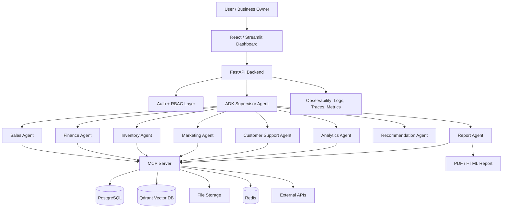
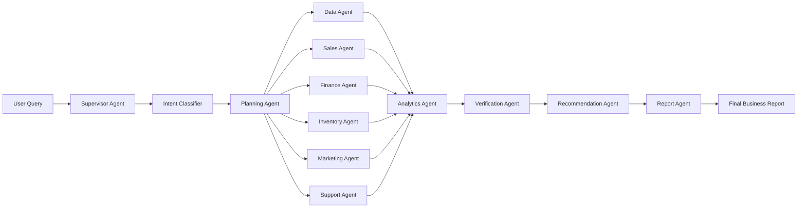
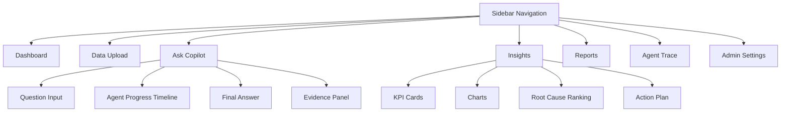
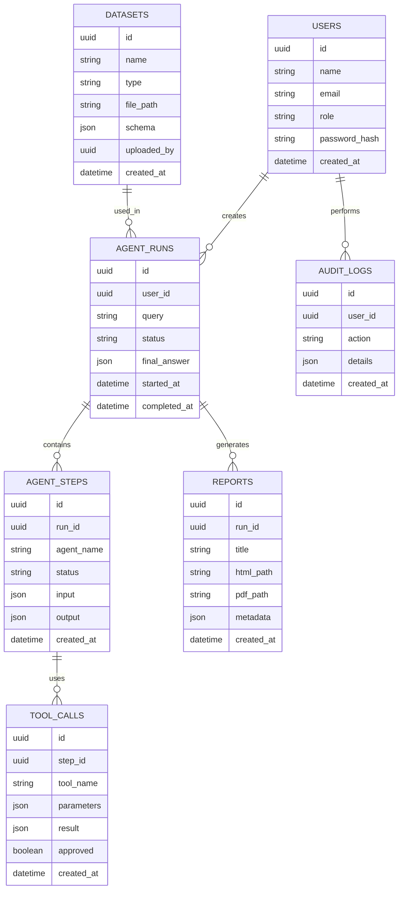

# AI Business Decision Copilot

## Production-Grade Capstone Project Blueprint

**Track:** Agents for Business  
**Project Type:** Multi-agent business intelligence and decision-support system  
**Target Event:** Kaggle 5-Day AI Agents: Intensive Vibe Coding Capstone Project with Google  
**Primary Goal:** Build an AI agent system that helps business owners and managers understand performance problems, identify root causes, and generate actionable business decisions from multiple data sources.

---

## 1. Project Summary

### 1.1 Problem Statement

Small and medium businesses often store important business data across disconnected systems such as spreadsheets, invoices, CRM exports, support tickets, sales reports, marketing campaign reports, and email updates. When revenue drops, inventory becomes blocked, customer complaints increase, or marketing spend performs poorly, managers must manually check multiple files and dashboards to understand the cause.

This wastes time and often leads to delayed or inaccurate decisions.

### 1.2 Proposed Solution

**AI Business Decision Copilot** is a production-grade multi-agent system that analyzes business data from multiple sources and answers decision-level business questions such as:

- Why did revenue drop this month?
- Which products are underperforming?
- Which customers are likely to churn?
- Which region is losing profitability?
- Which marketing campaign is wasting budget?
- What should the business owner do next?

The system does not simply generate a chatbot response. It uses specialized agents, MCP tools, analytics pipelines, and evidence-backed reasoning to produce a structured business diagnosis and action plan.

### 1.3 Core Value

The project helps business teams move from raw data to decisions faster by combining:

- Multi-agent reasoning
- Business analytics
- MCP-based tool access
- Data quality checks
- Root-cause analysis
- Recommendation generation
- Report generation
- Human approval for sensitive actions

---

## 2. Why This Project Is Strong for the Capstone

This project directly demonstrates the concepts expected in the capstone:

| Capstone Concept | How This Project Demonstrates It |
|---|---|
| Agent / Multi-agent system using ADK | Supervisor Agent coordinates Sales, Finance, Inventory, Marketing, Support, Analytics, and Report agents. |
| MCP Server | MCP tools expose database query, CSV analysis, report generation, chart generation, email draft, and document search. |
| Agent Skills | Reusable skills for revenue analysis, churn analysis, anomaly detection, report writing, and chart generation. |
| Security features | JWT auth, role-based access control, API key isolation, input validation, audit logs, human approval. |
| Deployability | Dockerized FastAPI backend, frontend UI, PostgreSQL, Redis, and optional Cloud Run deployment. |
| Antigravity / Vibe Coding demo | Use Antigravity in the video to show how agents, MCP server, and project structure were built or improved. |

---

## 3. Main Use Case

### User Question

> “Why did our sales decrease this month and what should we do next?”

### System Workflow

1. User asks the question in the dashboard.
2. Supervisor Agent classifies the intent as a business diagnosis request.
3. Data Agent checks available datasets.
4. Sales Agent analyzes revenue, order volume, region, category, and product trends.
5. Inventory Agent checks stockouts, slow-moving SKUs, and blocked inventory.
6. Marketing Agent checks campaign spend, conversion rate, and channel performance.
7. Customer Support Agent checks complaints, returns, refunds, and sentiment.
8. Analytics Agent performs anomaly detection and root-cause ranking.
9. Recommendation Agent generates action items.
10. Report Agent creates a final executive report with charts and evidence.
11. System stores the report and allows export as PDF.

---

## 4. Target Users

| User Type | Benefit |
|---|---|
| Business Owner | Understand what is going wrong without manually checking dashboards. |
| Sales Manager | Identify weak products, regions, or customers. |
| Finance Manager | Detect margin problems, revenue leakage, and high expenses. |
| Marketing Manager | Understand which campaigns are wasting budget. |
| Operations Manager | Identify inventory, delivery, or return-related business issues. |
| Startup Founder | Get quick business insights from uploaded CSV/Excel files. |

---

## 5. Key Features

### 5.1 MVP Features

- Secure login
- Upload CSV/Excel business datasets
- Ask business questions in natural language
- Multi-agent analysis pipeline
- Revenue and sales trend analysis
- Product and category performance analysis
- Inventory issue detection
- Customer complaint analysis
- Root-cause explanation
- Business recommendation generation
- Charts and dashboard cards
- Exportable business report

### 5.2 Production-Grade Features

- Role-based access control
- Audit logs for every agent action
- Human approval before sending reports or emails
- MCP tool permission layer
- Data validation before analysis
- Prompt-injection protection for uploaded text
- Agent trace viewer
- Cost and latency tracking
- Retry and fallback mechanism
- Background job queue
- Report versioning
- Dataset lineage tracking
- Docker-based deployment
- Environment-based secrets management

### 5.3 Advanced Enhancements

- Forecast next-month revenue
- Detect customer churn risk
- Auto-generate board meeting summary
- Email report to stakeholders after approval
- Compare multiple time periods
- Explain confidence score for each recommendation
- Connect to Google Sheets / BigQuery / PostgreSQL
- Add vector search over business documents
- Add knowledge graph for entities such as customers, products, regions, campaigns, and tickets

---

## 6. System Architecture

### 6.1 High-Level Architecture



### 6.2 Agent Architecture



---

## 7. Agents and Responsibilities

### 7.1 Supervisor Agent

**Purpose:** Controls the full workflow.

**Responsibilities:**

- Understand user query
- Select required agents
- Create execution plan
- Enforce permission checks
- Collect agent outputs
- Ask Verification Agent to validate evidence
- Send final response to the user

### 7.2 Data Agent

**Purpose:** Finds and prepares the correct datasets.

**Responsibilities:**

- Identify available data sources
- Validate uploaded files
- Detect schema
- Check missing values
- Standardize date columns
- Create data profiling summary

### 7.3 Sales Agent

**Purpose:** Analyzes revenue and sales trends.

**Responsibilities:**

- Revenue by day/week/month
- Product-level sales
- Category-level sales
- Region-level sales
- Customer-level sales
- Average order value
- Conversion trend if available

### 7.4 Finance Agent

**Purpose:** Analyzes financial health.

**Responsibilities:**

- Gross revenue
- Net revenue
- Cost trends
- Margin analysis
- Expense increase detection
- Refund and discount impact

### 7.5 Inventory Agent

**Purpose:** Finds inventory-related causes.

**Responsibilities:**

- Stockout detection
- Slow-moving products
- Dead stock
- Inventory mismatch
- Demand-supply gap
- SKU-level issue summary

### 7.6 Marketing Agent

**Purpose:** Evaluates campaign performance.

**Responsibilities:**

- Campaign spend
- ROI
- Cost per acquisition
- Conversion rate
- Channel performance
- Poor-performing campaigns

### 7.7 Customer Support Agent

**Purpose:** Finds customer pain points.

**Responsibilities:**

- Complaint category analysis
- Return reasons
- Refund reasons
- Sentiment analysis
- Ticket spike detection
- Customer churn indicators

### 7.8 Analytics Agent

**Purpose:** Performs statistical and ML analysis.

**Responsibilities:**

- Anomaly detection
- Correlation analysis
- Trend detection
- Forecasting
- Root-cause ranking
- Churn risk scoring

### 7.9 Verification Agent

**Purpose:** Prevents hallucinated business claims.

**Responsibilities:**

- Check if every claim has data evidence
- Reject unsupported conclusions
- Validate calculations
- Generate confidence scores
- Identify missing data limitations

### 7.10 Recommendation Agent

**Purpose:** Converts analysis into business action.

**Responsibilities:**

- Generate prioritized action items
- Estimate business impact
- Assign urgency level
- Suggest owners
- Suggest next steps

### 7.11 Report Agent

**Purpose:** Creates final output.

**Responsibilities:**

- Executive summary
- Charts
- Tables
- Root-cause explanation
- Action plan
- PDF / HTML export

---

## 8. MCP Server Design

### 8.1 MCP Server Purpose

The MCP server exposes safe tools that agents can use to access data, run analysis, generate charts, and create reports.

### 8.2 MCP Tools

| Tool Name | Purpose |
|---|---|
| `query_business_db` | Query structured business data from PostgreSQL. |
| `read_uploaded_file` | Read uploaded CSV/Excel files. |
| `profile_dataset` | Generate missing value, schema, and statistics summary. |
| `run_sales_analysis` | Calculate revenue, product, and region performance. |
| `run_inventory_analysis` | Detect stockouts, slow-moving SKUs, and inventory risk. |
| `run_marketing_analysis` | Calculate campaign ROI and conversion performance. |
| `run_support_analysis` | Analyze complaints, sentiment, refunds, and returns. |
| `run_anomaly_detection` | Detect abnormal revenue, cost, or complaint patterns. |
| `generate_chart` | Generate charts from analysis results. |
| `generate_pdf_report` | Create final PDF business report. |
| `create_email_draft` | Create stakeholder email draft, only after approval. |
| `save_audit_log` | Store agent actions and tool calls. |

### 8.3 MCP Security Rules

- No direct shell execution
- Strict input schema validation
- Tool allowlist per role
- File type validation
- File size limits
- SQL query guardrails
- No destructive database operations from agent tools
- Human approval for email/report sharing
- Full audit logging

---

## 9. Data Sources

### 9.1 MVP Data Sources

Use sample CSV/Excel datasets:

- Sales data
- Product catalog
- Inventory data
- Customer data
- Marketing campaign data
- Support ticket data
- Expense data

### 9.2 Suggested Data Schema

#### Sales Table

| Column | Description |
|---|---|
| order_id | Unique order ID |
| order_date | Date of order |
| customer_id | Customer identifier |
| product_id | Product identifier |
| category | Product category |
| region | Sales region |
| quantity | Quantity sold |
| unit_price | Unit price |
| discount | Discount amount |
| revenue | Final revenue |

#### Inventory Table

| Column | Description |
|---|---|
| product_id | Product identifier |
| stock_available | Current stock |
| reorder_level | Minimum stock level |
| lead_time_days | Supplier lead time |
| blocked_stock | Blocked inventory |

#### Marketing Table

| Column | Description |
|---|---|
| campaign_id | Campaign identifier |
| channel | Marketing channel |
| spend | Campaign spend |
| impressions | Impressions |
| clicks | Clicks |
| conversions | Conversions |
| revenue_generated | Revenue attributed |

#### Support Tickets Table

| Column | Description |
|---|---|
| ticket_id | Ticket identifier |
| customer_id | Customer identifier |
| product_id | Product identifier |
| issue_type | Complaint category |
| sentiment | Positive, neutral, negative |
| created_date | Ticket date |
| resolution_time | Time to resolve |

---

## 10. User Interface Plan

### 10.1 UI Pages

| Page | Description |
|---|---|
| Login Page | Secure login for admin, manager, analyst. |
| Dashboard Home | KPI cards, recent reports, business health score. |
| Data Upload Page | Upload CSV/Excel files with schema mapping. |
| Ask Copilot Page | Natural language business question interface. |
| Agent Trace Page | Shows which agents worked and what tools were used. |
| Insights Page | Charts, root causes, anomalies, and recommendations. |
| Reports Page | Generated reports with PDF export. |
| Admin Settings | User roles, API keys, tool permissions, audit logs. |

### 10.2 Dashboard Components

- Revenue KPI card
- Profit margin KPI card
- Sales trend chart
- Product performance table
- Region performance map/table
- Inventory risk card
- Marketing ROI chart
- Complaint spike chart
- Root-cause ranking panel
- Recommended action board
- Agent workflow timeline

### 10.3 UI Layout



### 10.4 Professional UI Enhancements

- Clean SaaS-style layout
- Sidebar navigation
- Dark/light mode
- KPI cards with trend indicators
- Step-by-step agent progress animation
- Confidence score badges
- Evidence chips attached to claims
- Download report button
- Approve email button
- Toast notifications
- Loading skeletons
- Responsive design

---

## 11. Backend Architecture

### 11.1 Backend Services

| Service | Responsibility |
|---|---|
| API Gateway / FastAPI | Main API layer |
| Auth Service | Login, JWT, RBAC |
| Agent Orchestrator | ADK agent workflow |
| MCP Server | Tool execution layer |
| Data Service | File parsing, schema validation |
| Analytics Service | ML/statistical computation |
| Report Service | HTML/PDF report generation |
| Audit Service | Logs actions and tool usage |
| Notification Service | Email draft and approval flow |

### 11.2 API Endpoints

| Endpoint | Method | Purpose |
|---|---|---|
| `/auth/login` | POST | User login |
| `/auth/me` | GET | Current user profile |
| `/datasets/upload` | POST | Upload business files |
| `/datasets/{id}/profile` | GET | Dataset profiling |
| `/copilot/query` | POST | Ask business question |
| `/copilot/runs/{run_id}` | GET | Get agent run status |
| `/insights/{run_id}` | GET | Get generated insights |
| `/reports/{run_id}` | GET | Get report data |
| `/reports/{run_id}/pdf` | GET | Download PDF |
| `/audit/logs` | GET | View audit logs |
| `/admin/users` | GET/POST | User management |

---

## 12. Database Design



---

## 13. Recommended Tech Stack

### 13.1 Core Stack

| Layer | Technology |
|---|---|
| Agent Framework | Google ADK |
| LLM | Gemini API |
| MCP | Python MCP server |
| Backend | FastAPI |
| Frontend | React + Tailwind CSS or Streamlit for faster delivery |
| Database | PostgreSQL |
| Vector DB | Qdrant or Chroma |
| Cache / Queue | Redis |
| Background Jobs | Celery / RQ |
| Charts | Plotly / Recharts |
| PDF Reports | WeasyPrint / ReportLab |
| Auth | JWT + RBAC |
| Deployment | Docker + Cloud Run / Render / Railway |
| Observability | OpenTelemetry + structured logs |

### 13.2 Recommended for Fast Capstone Build

If time is limited, use:

- FastAPI backend
- Streamlit frontend
- PostgreSQL or SQLite
- ADK agents
- MCP server
- Gemini API
- Docker
- GitHub public repository

---

## 14. Production Security Design

### 14.1 Authentication

- Email and password login
- Password hashing using bcrypt
- JWT access token
- Optional refresh token

### 14.2 Authorization

Roles:

| Role | Permissions |
|---|---|
| Admin | Manage users, upload data, run analysis, view audit logs |
| Manager | Upload data, ask questions, generate reports |
| Analyst | Ask questions, view insights |
| Viewer | View reports only |

### 14.3 Agent Tool Security

- Each tool requires permission
- Sensitive tools require human approval
- Tool calls stored in audit logs
- No agent can directly access secrets
- No destructive database operation through MCP

### 14.4 Data Security

- Environment variables for secrets
- `.env` excluded from GitHub
- File validation
- Row-level user isolation
- Dataset ownership check
- PII masking where required

### 14.5 Prompt Injection Protection

- Separate system instructions from uploaded content
- Treat uploaded text as untrusted data
- Do not execute instructions from data files
- Verification Agent checks suspicious outputs
- MCP tools validate all parameters

---

## 15. Agent Skills

Create skills as reusable modules.

### 15.1 Skill List

| Skill | Purpose |
|---|---|
| `dataset_profile_skill` | Understand dataset columns, quality, and missing values. |
| `sales_diagnosis_skill` | Analyze revenue drop and sales performance. |
| `inventory_risk_skill` | Detect stockout and slow-moving inventory. |
| `marketing_roi_skill` | Analyze campaign performance. |
| `support_sentiment_skill` | Analyze customer complaints and sentiment. |
| `root_cause_skill` | Rank likely causes of business problem. |
| `recommendation_skill` | Generate business action plan. |
| `report_generation_skill` | Create executive summary and PDF report. |
| `verification_skill` | Validate every claim using data evidence. |

### 15.2 Skill Example Behavior

**Input:** Sales data and question  
**Output:** Revenue trend, top declining products, possible cause, evidence table, confidence score

---

## 16. ML and Analytics Components

### 16.1 Analytics Methods

- Time-series trend analysis
- Moving average comparison
- Month-over-month growth
- Week-over-week growth
- Revenue contribution analysis
- Pareto analysis
- Z-score anomaly detection
- Isolation Forest anomaly detection
- Customer segmentation
- Churn risk scoring
- Forecasting using Prophet / statsmodels / XGBoost

### 16.2 Business Metrics

| Metric | Formula |
|---|---|
| Revenue | quantity × unit_price - discount |
| Gross Margin | revenue - cost |
| Average Order Value | revenue / number of orders |
| Conversion Rate | conversions / clicks |
| Return Rate | returned orders / total orders |
| Complaint Rate | complaints / orders |
| Stockout Risk | stock_available < reorder_level |
| Campaign ROI | attributed revenue / campaign spend |

---

## 17. Development Phases, Tasks, and Subtasks

## Phase 1: Project Planning and Setup

### Task 1.1: Define Scope

- Subtask 1.1.1: Select track as Agents for Business.
- Subtask 1.1.2: Define primary use case: revenue drop diagnosis.
- Subtask 1.1.3: Define secondary use cases: inventory risk, marketing ROI, support complaints.
- Subtask 1.1.4: Define MVP and advanced features.
- Subtask 1.1.5: Write problem statement and value proposition.

### Task 1.2: Repository Setup

- Subtask 1.2.1: Create GitHub repository.
- Subtask 1.2.2: Add project README.
- Subtask 1.2.3: Add `.gitignore`.
- Subtask 1.2.4: Add `.env.example`.
- Subtask 1.2.5: Add license.
- Subtask 1.2.6: Add folder structure.

### Task 1.3: Define Architecture

- Subtask 1.3.1: Create high-level architecture diagram.
- Subtask 1.3.2: Create agent workflow diagram.
- Subtask 1.3.3: Create MCP tool architecture.
- Subtask 1.3.4: Create database ER diagram.
- Subtask 1.3.5: Add diagrams to README.

---

## Phase 2: Data Layer

### Task 2.1: Create Sample Business Datasets

- Subtask 2.1.1: Create sales dataset.
- Subtask 2.1.2: Create inventory dataset.
- Subtask 2.1.3: Create marketing dataset.
- Subtask 2.1.4: Create support ticket dataset.
- Subtask 2.1.5: Create expense dataset.
- Subtask 2.1.6: Add intentional anomalies for demo.

### Task 2.2: File Upload Service

- Subtask 2.2.1: Implement CSV upload.
- Subtask 2.2.2: Implement Excel upload.
- Subtask 2.2.3: Validate file type.
- Subtask 2.2.4: Validate file size.
- Subtask 2.2.5: Store file metadata.
- Subtask 2.2.6: Store parsed schema.

### Task 2.3: Dataset Profiling

- Subtask 2.3.1: Detect column types.
- Subtask 2.3.2: Detect missing values.
- Subtask 2.3.3: Detect duplicate rows.
- Subtask 2.3.4: Generate descriptive statistics.
- Subtask 2.3.5: Generate data quality score.

---

## Phase 3: Backend and Database

### Task 3.1: FastAPI Setup

- Subtask 3.1.1: Create FastAPI app.
- Subtask 3.1.2: Add CORS configuration.
- Subtask 3.1.3: Add health check endpoint.
- Subtask 3.1.4: Add API router structure.
- Subtask 3.1.5: Add error handling middleware.

### Task 3.2: Database Setup

- Subtask 3.2.1: Create PostgreSQL database.
- Subtask 3.2.2: Add SQLAlchemy models.
- Subtask 3.2.3: Add Alembic migrations.
- Subtask 3.2.4: Create users table.
- Subtask 3.2.5: Create datasets table.
- Subtask 3.2.6: Create agent runs table.
- Subtask 3.2.7: Create audit logs table.

### Task 3.3: Auth System

- Subtask 3.3.1: Implement user registration for local demo.
- Subtask 3.3.2: Implement login.
- Subtask 3.3.3: Hash passwords.
- Subtask 3.3.4: Generate JWT token.
- Subtask 3.3.5: Add role-based access control.
- Subtask 3.3.6: Protect sensitive routes.

---

## Phase 4: MCP Server

### Task 4.1: MCP Server Setup

- Subtask 4.1.1: Create MCP server project.
- Subtask 4.1.2: Define tool schemas.
- Subtask 4.1.3: Add input validation.
- Subtask 4.1.4: Add permission checks.
- Subtask 4.1.5: Add audit logging.

### Task 4.2: Data Tools

- Subtask 4.2.1: Implement `read_uploaded_file`.
- Subtask 4.2.2: Implement `profile_dataset`.
- Subtask 4.2.3: Implement `query_business_db`.
- Subtask 4.2.4: Implement safe query restrictions.

### Task 4.3: Analytics Tools

- Subtask 4.3.1: Implement `run_sales_analysis`.
- Subtask 4.3.2: Implement `run_inventory_analysis`.
- Subtask 4.3.3: Implement `run_marketing_analysis`.
- Subtask 4.3.4: Implement `run_support_analysis`.
- Subtask 4.3.5: Implement `run_anomaly_detection`.

### Task 4.4: Output Tools

- Subtask 4.4.1: Implement `generate_chart`.
- Subtask 4.4.2: Implement `generate_pdf_report`.
- Subtask 4.4.3: Implement `create_email_draft`.
- Subtask 4.4.4: Add human approval before email creation.

---

## Phase 5: ADK Multi-Agent System

### Task 5.1: ADK Setup

- Subtask 5.1.1: Install ADK.
- Subtask 5.1.2: Configure Gemini model.
- Subtask 5.1.3: Create base agent configuration.
- Subtask 5.1.4: Connect ADK agents to MCP tools.
- Subtask 5.1.5: Add agent logging.

### Task 5.2: Build Supervisor Agent

- Subtask 5.2.1: Define supervisor prompt.
- Subtask 5.2.2: Add intent classification.
- Subtask 5.2.3: Add task planning.
- Subtask 5.2.4: Add agent routing.
- Subtask 5.2.5: Add final response aggregation.

### Task 5.3: Build Specialist Agents

- Subtask 5.3.1: Build Data Agent.
- Subtask 5.3.2: Build Sales Agent.
- Subtask 5.3.3: Build Finance Agent.
- Subtask 5.3.4: Build Inventory Agent.
- Subtask 5.3.5: Build Marketing Agent.
- Subtask 5.3.6: Build Support Agent.
- Subtask 5.3.7: Build Analytics Agent.
- Subtask 5.3.8: Build Verification Agent.
- Subtask 5.3.9: Build Recommendation Agent.
- Subtask 5.3.10: Build Report Agent.

### Task 5.4: Agent Skills

- Subtask 5.4.1: Create dataset profiling skill.
- Subtask 5.4.2: Create revenue diagnosis skill.
- Subtask 5.4.3: Create inventory risk skill.
- Subtask 5.4.4: Create marketing ROI skill.
- Subtask 5.4.5: Create support sentiment skill.
- Subtask 5.4.6: Create root-cause ranking skill.
- Subtask 5.4.7: Create report generation skill.

---

## Phase 6: Analytics and ML

### Task 6.1: Sales Analytics

- Subtask 6.1.1: Calculate monthly revenue.
- Subtask 6.1.2: Calculate revenue by product.
- Subtask 6.1.3: Calculate revenue by category.
- Subtask 6.1.4: Calculate revenue by region.
- Subtask 6.1.5: Detect revenue decline.

### Task 6.2: Inventory Analytics

- Subtask 6.2.1: Detect stockout products.
- Subtask 6.2.2: Detect low stock products.
- Subtask 6.2.3: Detect blocked inventory.
- Subtask 6.2.4: Compare sales decline with stock availability.

### Task 6.3: Marketing Analytics

- Subtask 6.3.1: Calculate campaign ROI.
- Subtask 6.3.2: Calculate cost per conversion.
- Subtask 6.3.3: Detect campaign performance drop.
- Subtask 6.3.4: Compare marketing drop with sales drop.

### Task 6.4: Support Analytics

- Subtask 6.4.1: Group tickets by issue type.
- Subtask 6.4.2: Detect complaint spikes.
- Subtask 6.4.3: Analyze negative sentiment.
- Subtask 6.4.4: Compare complaint spike with revenue drop.

### Task 6.5: Root-Cause Ranking

- Subtask 6.5.1: Define root-cause scoring logic.
- Subtask 6.5.2: Combine signals from all agents.
- Subtask 6.5.3: Generate confidence score.
- Subtask 6.5.4: Generate evidence table.

---

## Phase 7: Frontend UI

### Task 7.1: UI Setup

- Subtask 7.1.1: Choose React + Tailwind or Streamlit.
- Subtask 7.1.2: Create layout.
- Subtask 7.1.3: Add sidebar navigation.
- Subtask 7.1.4: Add theme styling.
- Subtask 7.1.5: Add responsive design.

### Task 7.2: Login UI

- Subtask 7.2.1: Create login form.
- Subtask 7.2.2: Connect to login API.
- Subtask 7.2.3: Store token securely.
- Subtask 7.2.4: Add logout.

### Task 7.3: Data Upload UI

- Subtask 7.3.1: Add drag-and-drop upload.
- Subtask 7.3.2: Show uploaded datasets.
- Subtask 7.3.3: Show schema preview.
- Subtask 7.3.4: Show data quality report.

### Task 7.4: Copilot UI

- Subtask 7.4.1: Add chat input.
- Subtask 7.4.2: Add suggested business questions.
- Subtask 7.4.3: Show agent progress timeline.
- Subtask 7.4.4: Show final answer.
- Subtask 7.4.5: Show evidence panel.

### Task 7.5: Insights UI

- Subtask 7.5.1: Add KPI cards.
- Subtask 7.5.2: Add sales trend chart.
- Subtask 7.5.3: Add product decline chart.
- Subtask 7.5.4: Add inventory risk chart.
- Subtask 7.5.5: Add marketing ROI chart.
- Subtask 7.5.6: Add complaint spike chart.
- Subtask 7.5.7: Add root-cause ranking.

### Task 7.6: Reports UI

- Subtask 7.6.1: Show generated reports.
- Subtask 7.6.2: Add PDF download.
- Subtask 7.6.3: Add approval button.
- Subtask 7.6.4: Add email draft preview.

---

## Phase 8: Observability and Reliability

### Task 8.1: Logging

- Subtask 8.1.1: Add structured logs.
- Subtask 8.1.2: Log API requests.
- Subtask 8.1.3: Log agent runs.
- Subtask 8.1.4: Log MCP tool calls.
- Subtask 8.1.5: Mask sensitive values in logs.

### Task 8.2: Agent Trace

- Subtask 8.2.1: Store each agent step.
- Subtask 8.2.2: Store tool input and output.
- Subtask 8.2.3: Store execution time.
- Subtask 8.2.4: Display trace in UI.

### Task 8.3: Reliability

- Subtask 8.3.1: Add retry for failed tool calls.
- Subtask 8.3.2: Add timeout handling.
- Subtask 8.3.3: Add fallback response.
- Subtask 8.3.4: Add graceful error messages.

---

## Phase 9: Testing

### Task 9.1: Unit Testing

- Subtask 9.1.1: Test dataset profiling.
- Subtask 9.1.2: Test sales analytics.
- Subtask 9.1.3: Test inventory analytics.
- Subtask 9.1.4: Test marketing analytics.
- Subtask 9.1.5: Test support analytics.

### Task 9.2: API Testing

- Subtask 9.2.1: Test auth APIs.
- Subtask 9.2.2: Test upload API.
- Subtask 9.2.3: Test copilot query API.
- Subtask 9.2.4: Test report API.

### Task 9.3: Agent Testing

- Subtask 9.3.1: Test supervisor routing.
- Subtask 9.3.2: Test tool selection.
- Subtask 9.3.3: Test unsupported query handling.
- Subtask 9.3.4: Test hallucination prevention.

### Task 9.4: Security Testing

- Subtask 9.4.1: Test unauthorized access.
- Subtask 9.4.2: Test invalid file upload.
- Subtask 9.4.3: Test prompt injection content.
- Subtask 9.4.4: Test SQL injection attempts.
- Subtask 9.4.5: Test role permission restrictions.

---

## Phase 10: Deployment

### Task 10.1: Dockerization

- Subtask 10.1.1: Create backend Dockerfile.
- Subtask 10.1.2: Create frontend Dockerfile.
- Subtask 10.1.3: Create MCP server Dockerfile.
- Subtask 10.1.4: Create docker-compose file.
- Subtask 10.1.5: Add health checks.

### Task 10.2: Environment Configuration

- Subtask 10.2.1: Create `.env.example`.
- Subtask 10.2.2: Document required API keys.
- Subtask 10.2.3: Configure local environment.
- Subtask 10.2.4: Configure production environment.

### Task 10.3: Public Demo

- Subtask 10.3.1: Deploy frontend.
- Subtask 10.3.2: Deploy backend.
- Subtask 10.3.3: Deploy MCP server.
- Subtask 10.3.4: Test live demo.
- Subtask 10.3.5: Add demo user credentials if login is required; however, for Kaggle, public demo should not require private login.

---

## Phase 11: Kaggle Submission Assets

### Task 11.1: README

- Subtask 11.1.1: Add project overview.
- Subtask 11.1.2: Add problem statement.
- Subtask 11.1.3: Add architecture diagram.
- Subtask 11.1.4: Add setup instructions.
- Subtask 11.1.5: Add demo instructions.
- Subtask 11.1.6: Add security notes.
- Subtask 11.1.7: Add screenshots.

### Task 11.2: Kaggle Writeup

- Subtask 11.2.1: Write title and subtitle.
- Subtask 11.2.2: Explain problem.
- Subtask 11.2.3: Explain solution.
- Subtask 11.2.4: Explain architecture.
- Subtask 11.2.5: Explain agents and tools.
- Subtask 11.2.6: Explain security and deployment.
- Subtask 11.2.7: Add results and screenshots.
- Subtask 11.2.8: Keep below 2,500 words.

### Task 11.3: Demo Video

- Subtask 11.3.1: Create 5-minute script.
- Subtask 11.3.2: Show problem statement.
- Subtask 11.3.3: Show architecture.
- Subtask 11.3.4: Show live demo.
- Subtask 11.3.5: Show ADK agents.
- Subtask 11.3.6: Show MCP tools.
- Subtask 11.3.7: Show security features.
- Subtask 11.3.8: Upload to YouTube.

---

## 18. Suggested Folder Structure

```text
ai-business-decision-copilot/
│
├── README.md
├── .env.example
├── .gitignore
├── docker-compose.yml
├── LICENSE
│
├── backend/
│   ├── app/
│   │   ├── main.py
│   │   ├── core/
│   │   │   ├── config.py
│   │   │   ├── security.py
│   │   │   └── logging.py
│   │   ├── api/
│   │   │   ├── auth.py
│   │   │   ├── datasets.py
│   │   │   ├── copilot.py
│   │   │   ├── reports.py
│   │   │   └── audit.py
│   │   ├── models/
│   │   ├── schemas/
│   │   ├── services/
│   │   └── database.py
│   ├── tests/
│   └── Dockerfile
│
├── agents/
│   ├── supervisor_agent.py
│   ├── data_agent.py
│   ├── sales_agent.py
│   ├── finance_agent.py
│   ├── inventory_agent.py
│   ├── marketing_agent.py
│   ├── support_agent.py
│   ├── analytics_agent.py
│   ├── verification_agent.py
│   ├── recommendation_agent.py
│   ├── report_agent.py
│   └── skills/
│       ├── dataset_profile_skill.py
│       ├── sales_diagnosis_skill.py
│       ├── inventory_risk_skill.py
│       ├── marketing_roi_skill.py
│       ├── support_sentiment_skill.py
│       ├── root_cause_skill.py
│       └── report_generation_skill.py
│
├── mcp_server/
│   ├── server.py
│   ├── tools/
│   │   ├── data_tools.py
│   │   ├── sales_tools.py
│   │   ├── inventory_tools.py
│   │   ├── marketing_tools.py
│   │   ├── support_tools.py
│   │   ├── chart_tools.py
│   │   └── report_tools.py
│   ├── security/
│   │   ├── permissions.py
│   │   └── validators.py
│   └── Dockerfile
│
├── frontend/
│   ├── index.html
│   ├── src/
│   │   ├── scripts/
│   │   └── styles/
│   ├── README.md
│   └── Dockerfile
│
├── data/
│   ├── sample_sales.csv
│   ├── sample_inventory.csv
│   ├── sample_marketing.csv
│   ├── sample_support_tickets.csv
│   └── sample_expenses.csv
│
├── notebooks/
│   └── data_generation.ipynb
│
├── docs/
│   ├── architecture.md
│   ├── api_reference.md
│   ├── agent_design.md
│   ├── mcp_tools.md
│   ├── security.md
│   └── demo_script.md
│
└── deployment/
    ├── cloud_run.md
    ├── render.md
    └── railway.md
```

---

## 19. Example Final Output

### User Query

> Why did revenue decrease in June?

### AI Response

```text
Executive Summary:
Revenue decreased by 18.4% in June compared with May.
The most likely causes are:

1. Stockout of top-selling products in the Mobile Accessories category.
2. Paid marketing ROI dropped by 32% after campaign spend shifted to low-converting channels.
3. Customer complaints increased by 41%, mainly related to delayed delivery.

Recommended Actions:

1. Reorder the top 12 stockout SKUs immediately.
2. Pause Campaign C and reallocate 40% budget to Campaign A.
3. Investigate delivery partner delays in the West region.
4. Offer retention discounts to 120 high-value customers affected by delays.

Confidence Score: 87%
Evidence: Sales data, inventory table, marketing report, support tickets.
```

---

## 20. Demo Storyboard

### Scene 1: Problem

Show that a business owner has multiple files and cannot quickly understand why sales dropped.

### Scene 2: Upload Data

Upload sales, inventory, marketing, and support datasets.

### Scene 3: Ask Copilot

Ask:

> Why did sales decrease this month?

### Scene 4: Agent Workflow

Show timeline:

- Supervisor Agent started
- Sales Agent analyzing revenue
- Inventory Agent checking stock
- Marketing Agent checking campaigns
- Support Agent checking complaints
- Analytics Agent ranking root causes
- Report Agent generating summary

### Scene 5: Final Report

Show:

- Revenue chart
- Root-cause ranking
- Recommended actions
- Evidence table
- PDF download

### Scene 6: Technical Explanation

Show:

- ADK agents
- MCP server tools
- Security layer
- Docker deployment
- GitHub repository

---

## 21. Minimum Viable Product Checklist

- [ ] Public GitHub repository
- [ ] README with setup instructions
- [ ] ADK-based multi-agent system
- [ ] MCP server with at least 5 tools
- [ ] FastAPI backend
- [ ] Basic frontend UI
- [ ] Upload sample CSV files
- [ ] Ask business question
- [ ] Generate insights
- [ ] Generate charts
- [ ] Generate report
- [ ] Add authentication
- [ ] Add audit logs
- [ ] Docker setup
- [ ] Demo video under 5 minutes
- [ ] Kaggle Writeup under 2,500 words

---

## 22. Enhancements That Can Make the Project Stand Out

1. **Agent Trace Viewer**  
   Show every agent step, tool call, execution time, and evidence.

2. **Evidence-Based Answering**  
   Every recommendation should show which dataset supports it.

3. **Human Approval Layer**  
   Before sending an email or sharing a report, user must approve.

4. **Confidence Scoring**  
   Each root cause receives a confidence score.

5. **Prompt Injection Defense**  
   Uploaded files are treated as untrusted data.

6. **Business Health Score**  
   A single score from 0 to 100 summarizing revenue, inventory, marketing, and support health.

7. **What-If Simulator**  
   User asks: “What happens if I increase marketing spend by 20%?”

8. **Auto-Generated Board Report**  
   One-click PDF with executive-ready language.

9. **Dataset Quality Score**  
   Before analysis, show whether the dataset is reliable.

10. **Role-Based Views**  
   CEO sees summary; analyst sees detailed data; admin sees logs.

---

## 23. Suggested README Sections

```markdown
# AI Business Decision Copilot

## Problem

## Solution

## Demo

## Architecture

## Agent Design

## MCP Tools

## Security Features

## Tech Stack

## Setup Instructions

## Environment Variables

## Running Locally

## Running with Docker

## Sample Questions

## Screenshots

## Future Improvements

## License
```

---

## 24. Suggested Kaggle Writeup Structure

1. Title
2. Subtitle
3. Problem Statement
4. Why Agents Are Needed
5. Solution Overview
6. Architecture
7. Agent Design
8. MCP Tooling
9. Security and Deployment
10. Demo Results
11. Challenges Faced
12. Future Scope
13. Conclusion

---

## 25. Final Recommendation

For the Kaggle capstone, keep the project focused on one impressive use case:

> **Revenue Drop Diagnosis and Business Action Recommendation**

Do not try to build every possible business feature in the first version. Build one polished workflow end to end:

```text
Upload business data → Ask why revenue dropped → Multi-agent analysis → Root-cause ranking → Evidence-backed recommendation → PDF report
```

This will be easier to complete, easier to demo, and much stronger for judging than a broad unfinished platform.

---

## 26. References

- Google ADK is an open-source agent development framework for building, debugging, and deploying reliable agents at enterprise scale.
- MCP is an open protocol for connecting AI applications to external data sources and tools.
- The Kaggle capstone evaluates submissions on pitch, writeup, video, implementation, architecture, code quality, documentation, and use of course concepts such as ADK, MCP, security, deployability, and agent skills.
