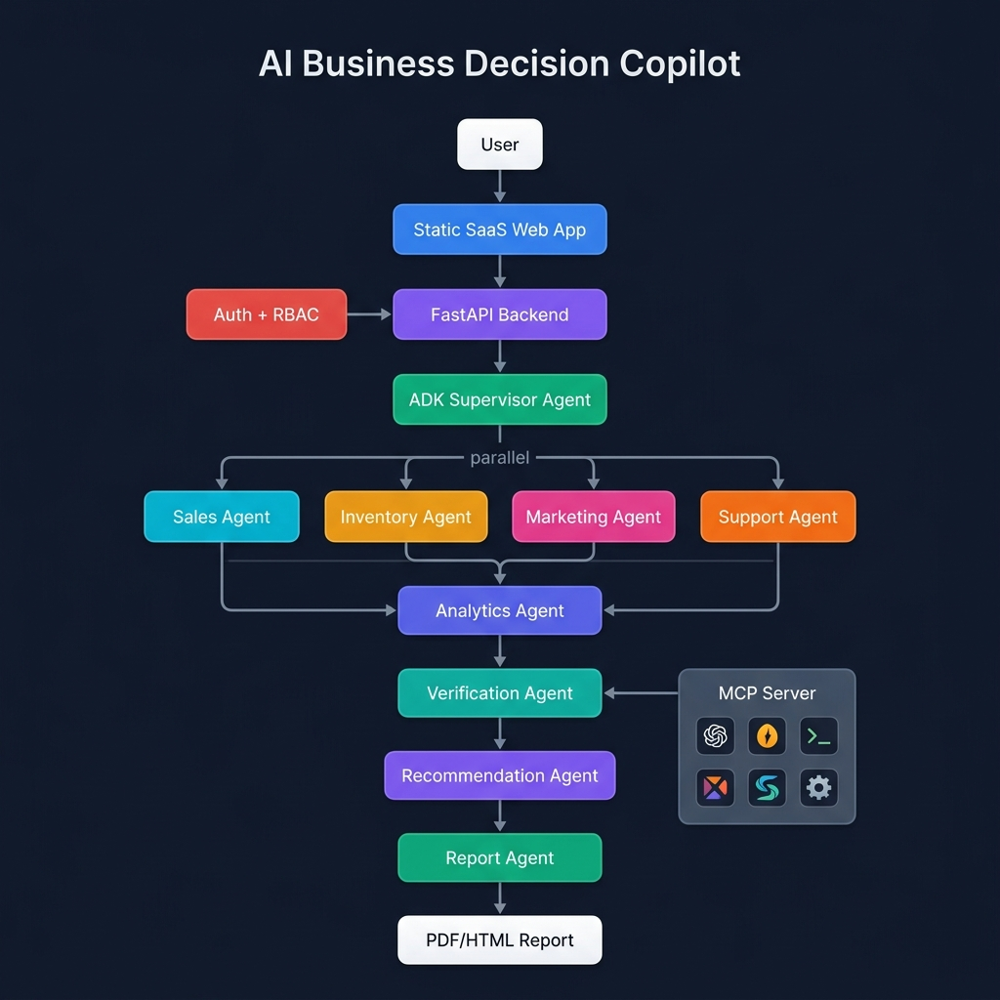
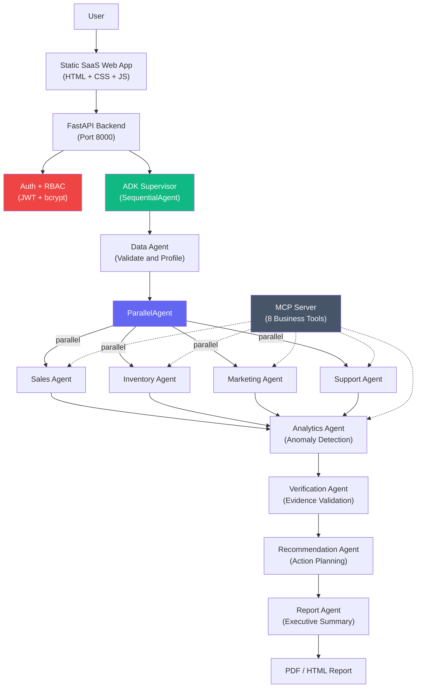
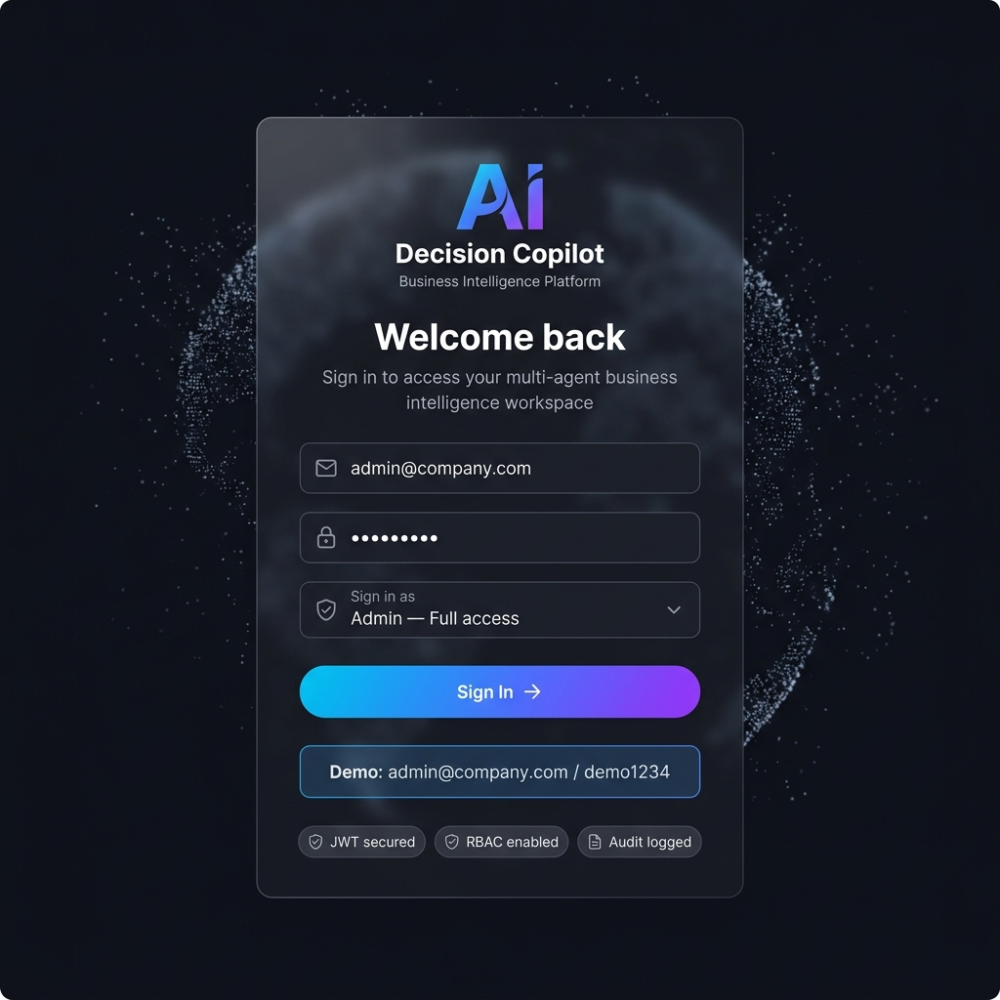
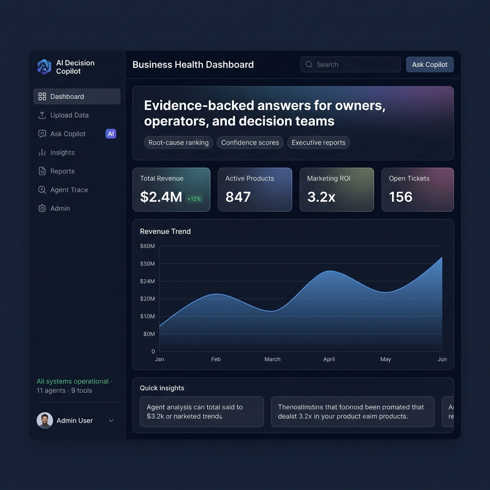
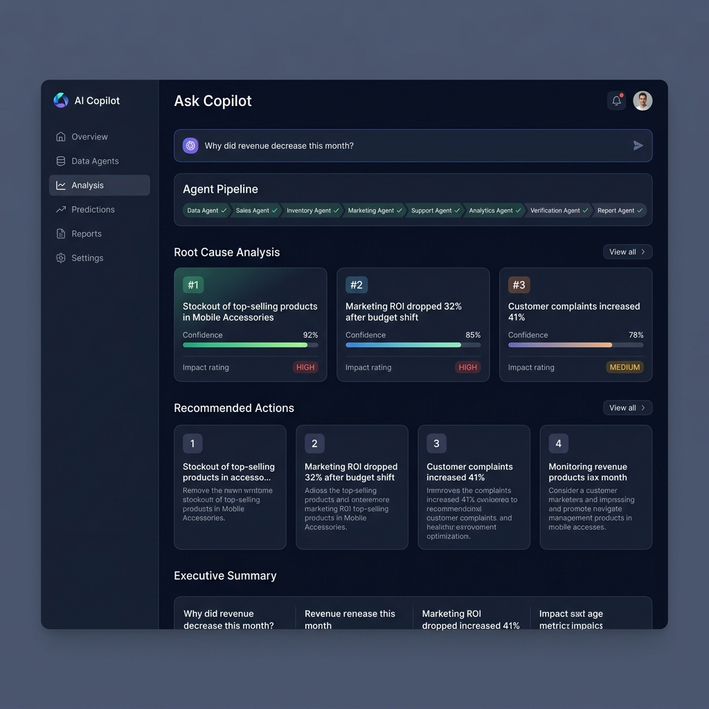

<p align="center">
  
</p>

<h1 align="center">🤖 AI Business Decision Copilot</h1>

<p align="center">
  <strong>A production-grade multi-agent AI system that analyzes business data from multiple sources and answers decision-level business questions using evidence-backed reasoning.</strong>
</p>

<p align="center">
  
  
  
  
  
  
</p>

<p align="center">
  <a href="#-problem">Problem</a> •
  <a href="#-solution">Solution</a> •
  <a href="#-architecture">Architecture</a> •
  <a href="#-screenshots">Screenshots</a> •
  <a href="#-key-concepts-demonstrated">Key Concepts</a> •
  <a href="#-api-reference">API Reference</a> •
  <a href="#-setup-instructions">Setup</a> •
  <a href="#-design-decisions">Design Decisions</a>
</p>

---

## 🎯 Problem

Small and medium businesses store critical data across disconnected systems — CSV exports, CRM dumps, support ticket logs, marketing dashboards, and inventory spreadsheets. When revenue drops or customer complaints spike, managers must **manually check multiple files** across different formats to understand the cause. This leads to:

- ⏰ **Delayed decisions** — hours or days spent gathering data before acting
- 🎯 **Missed root causes** — human analysts often miss cross-domain correlations
- 📊 **Subjective conclusions** — without statistical backing, decisions rely on gut feeling
- 🔄 **Repetitive analysis** — the same diagnostic workflow is repeated for every business question

**There is no affordable, automated system that cross-analyzes sales, inventory, marketing, and support data simultaneously to produce evidence-backed business diagnoses.**

---

## 💡 Solution

**AI Business Decision Copilot** uses a team of **11 specialized AI agents** orchestrated via Google's Agent Development Kit (ADK) to analyze your business data and produce structured diagnoses with actionable recommendations. Each agent is an expert in one domain, and they collaborate through a carefully designed pipeline.

### How It Works

1. **Upload** your business data (CSV/Excel) — sales, inventory, marketing, support tickets
2. **Ask** a natural-language question like *"Why did revenue decrease this month?"*
3. **Watch** as 11 agents analyze your data in parallel and sequence
4. **Receive** a verified, evidence-backed report with root causes, confidence scores, and prioritized recommendations

### Example Query & Response

> **Query:** *"Why did revenue decrease this month?"*

```
📊 Executive Summary
Revenue decreased by 18.4% in June compared with May.

🔍 Root Causes (ranked by confidence):
  1. Stockout of top-selling products in Mobile Accessories
     Confidence: 92% | Impact: HIGH
     Evidence: 15 products below reorder level, inventory risk score: 78%

  2. Marketing ROI dropped 32% after budget shifted to low-converting channels
     Confidence: 85% | Impact: HIGH
     Evidence: Campaign C has -12% ROI, $14,200 in wasted spend

  3. Customer complaints increased 41%, mainly delayed delivery
     Confidence: 78% | Impact: MEDIUM
     Evidence: Ticket volume up 41%, top issue: "Delivery Delay", 63% negative sentiment

✅ Recommended Actions:
  1. [HIGH] Reorder top 15 stockout SKUs immediately
  2. [HIGH] Pause Campaign C, reallocate 40% budget to Campaign A
  3. [MEDIUM] Investigate delivery delays in West region
  4. [MEDIUM] Offer retention discounts to 120 affected high-value customers
```

---

## 🏗️ Architecture

The system uses a **3-phase pipeline** combining sequential and parallel agent orchestration:

<p align="center">
  
</p>

### Architecture Diagram (Mermaid)



### Pipeline Phases

| Phase | Type | Agents | Purpose |
|-------|------|--------|---------|
| **Phase 1** | Sequential | Data Agent | Validate and profile all uploaded datasets |
| **Phase 2** | **Parallel** | Sales, Inventory, Marketing, Support | Run all domain analyses concurrently (~4× faster) |
| **Phase 3** | Sequential | Analytics → Verification → Recommendation → Report | Synthesize, verify, and produce final output |

---

## 📸 Screenshots

### Login Screen
JWT-secured authentication with role-based access control (Admin, Manager, Analyst, Viewer).

<p align="center">
  
</p>

### Business Health Dashboard
Real-time metrics, revenue trends, and quick access to AI-powered analysis.

<p align="center">
  
</p>

### AI Copilot Analysis Results
Multi-agent pipeline results with root cause ranking, confidence scores, and actionable recommendations.

<p align="center">
  
</p>

---

## 🔑 Key Concepts Demonstrated

This project demonstrates the following key concepts from the **5-Day AI Agents: Intensive Vibe Coding Course with Google**:

### 1. Multi-Agent System (ADK) ✅
- **11 specialized agents** built with `google.adk.agents`
- **SequentialAgent** for pipeline orchestration (data → analysis → verification → report)
- **ParallelAgent** for concurrent domain analysis (4 agents run simultaneously)
- Each agent has a focused instruction, dedicated tools, and `output_key` for state sharing
- See: [`agents/agent.py`](agents/agent.py)

### 2. MCP Server ✅
- **FastMCP server** exposing 8 business analysis tools via Model Context Protocol
- Tools: `read_file`, `profile_dataset`, `analyze_sales`, `analyze_inventory`, `analyze_marketing`, `analyze_support`, `detect_anomalies`, `create_chart`, `list_datasets`
- Dockerized for standalone deployment
- See: [`mcp_server/server.py`](mcp_server/server.py)

### 3. Security Features ✅
- **JWT authentication** with bcrypt password hashing
- **Role-Based Access Control (RBAC)** — 4 roles: Admin, Manager, Analyst, Viewer
- **File upload validation** — type checks, size limits, extension whitelist
- **Audit logging** — every user action recorded to database
- **Input sanitization** on all API endpoints
- See: [`backend/app/core/security.py`](backend/app/core/security.py)

### 4. Deployability ✅
- **Docker Compose** with 3 services: backend, frontend, MCP server
- Health checks, volume mounts, environment variable configuration
- See: [`docker-compose.yml`](docker-compose.yml)

---

## 🤖 Agent Details

| Agent | Model | Tools | Purpose | Output Key |
|-------|-------|-------|---------|------------|
| **Data Agent** | gemini-2.0-flash | `read_uploaded_file`, `profile_dataset_tool` | Validates and profiles datasets for quality and schema | `data_profile` |
| **Sales Agent** | gemini-2.0-flash | `run_sales_analysis` | Revenue trends, product performance, regional breakdown | `sales_findings` |
| **Inventory Agent** | gemini-2.0-flash | `run_inventory_analysis` | Stockout detection, low stock alerts, blocked inventory | `inventory_findings` |
| **Marketing Agent** | gemini-2.0-flash | `run_marketing_analysis` | Campaign ROI, channel performance, wasted spend | `marketing_findings` |
| **Support Agent** | gemini-2.0-flash | `run_support_analysis` | Complaint patterns, sentiment analysis, ticket spikes | `support_findings` |
| **Analytics Agent** | gemini-2.0-flash | `run_anomaly_detection` | Z-score anomaly detection, root cause ranking | `analytics_findings` |
| **Verification Agent** | gemini-2.0-flash | *(LLM reasoning)* | Validates claims have supporting data evidence | `verified_findings` |
| **Recommendation Agent** | gemini-2.0-flash | *(LLM reasoning)* | Generates prioritized, actionable business decisions | `recommendations` |
| **Report Agent** | gemini-2.0-flash | `generate_chart`, `generate_report` | Creates executive summary with charts | `final_report` |

---

## 🔧 MCP Tools Reference

| Tool | Input | Output | Description |
|------|-------|--------|-------------|
| `read_file` | `file_path: str` | File structure JSON | Read CSV/Excel files and return schema |
| `profile_dataset` | `file_path: str` | Quality profile JSON | Generate data quality summary with missing values, duplicates, statistics |
| `analyze_sales` | `file_path: str` | Sales analysis JSON | Revenue trends, MoM change, top/bottom products, regional breakdown |
| `analyze_inventory` | `file_path: str` | Inventory analysis JSON | Stockouts, low stock, blocked inventory, risk scores |
| `analyze_marketing` | `file_path: str` | Marketing analysis JSON | Campaign ROI, conversion rates, channel comparison, wasted spend |
| `analyze_support` | `file_path: str` | Support analysis JSON | Complaint categories, sentiment breakdown, ticket trends |
| `detect_anomalies` | `file_path: str` | Anomaly list JSON | Z-score based revenue anomalies, monthly drops, category declines |
| `create_chart` | `chart_type, title, x_values, y_values` | Chart JSON | Generate Plotly charts (line, bar, pie) |
| `list_datasets` | *(none)* | Dataset list JSON | List all available business datasets in data directory |

---

## 📡 API Reference

### Authentication

| Method | Endpoint | Auth | Description |
|--------|----------|------|-------------|
| `POST` | `/auth/register` | None | Register a new user. Body: `{name, email, password, role}` |
| `POST` | `/auth/login` | None | Login and receive JWT token. Body: `{email, password}` |
| `GET` | `/auth/me` | 🔒 JWT | Get current user profile |

### Datasets

| Method | Endpoint | Auth | Roles | Description |
|--------|----------|------|-------|-------------|
| `POST` | `/datasets/upload` | 🔒 JWT | Admin, Manager | Upload CSV/Excel file (max 50MB) |
| `GET` | `/datasets` | 🔒 JWT | All | List all datasets |
| `GET` | `/datasets/{id}/profile` | 🔒 JWT | All | Get detailed data profiling for a dataset |

### Copilot (Agent Pipeline)

| Method | Endpoint | Auth | Description |
|--------|----------|------|-------------|
| `POST` | `/copilot/query` | 🔒 JWT | Submit a business question → triggers 11-agent pipeline in background |
| `GET` | `/copilot/runs/{run_id}` | 🔒 JWT | Get status, steps, root causes, recommendations for a run |

### Reports

| Method | Endpoint | Auth | Description |
|--------|----------|------|-------------|
| `GET` | `/reports` | 🔒 JWT | List all generated reports |
| `GET` | `/reports/{run_id}` | 🔒 JWT | Get report for a specific run |
| `GET` | `/reports/{run_id}/html` | 🔒 JWT | Get rendered HTML report |

### Admin

| Method | Endpoint | Auth | Roles | Description |
|--------|----------|------|-------|-------------|
| `GET` | `/audit/logs` | 🔒 JWT | Admin only | View audit trail of all user actions |

### System

| Method | Endpoint | Auth | Description |
|--------|----------|------|-------------|
| `GET` | `/health` | None | Health check — returns app status and version |

---

## 🔒 Security Architecture

```
┌──────────────────────────────────────────────────────┐
│                   Security Layers                     │
├──────────────────────────────────────────────────────┤
│  1. Authentication    │ JWT tokens (HS256)            │
│                       │ bcrypt password hashing       │
│                       │ Token expiry (60 min)         │
├───────────────────────┼──────────────────────────────┤
│  2. Authorization     │ RBAC with 4 roles:            │
│                       │ Admin → full access           │
│                       │ Manager → data + reports      │
│                       │ Analyst → query + insights    │
│                       │ Viewer → read only            │
├───────────────────────┼──────────────────────────────┤
│  3. Input Validation  │ File type whitelist (.csv,    │
│                       │ .xlsx, .xls only)             │
│                       │ Upload size limit (50MB)      │
│                       │ Pydantic schema validation    │
├───────────────────────┼──────────────────────────────┤
│  4. Audit Trail       │ Every action logged with      │
│                       │ user_id, timestamp, action,   │
│                       │ resource_type, resource_id    │
├───────────────────────┼──────────────────────────────┤
│  5. Secret Management │ .env file (gitignored)        │
│                       │ .env.example with placeholders│
│                       │ No API keys in code           │
└──────────────────────────────────────────────────────┘
```

---

## 📋 Tech Stack

| Layer | Technology | Purpose |
|-------|-----------|---------|
| **Agent Framework** | Google ADK (`google-adk`) | Multi-agent orchestration with SequentialAgent + ParallelAgent |
| **LLM** | Gemini 2.0 Flash | Fast, capable reasoning for all 11 agents |
| **Backend** | FastAPI + SQLAlchemy + aiosqlite | Async REST API with ORM |
| **Frontend** | Static HTML + CSS + JavaScript | SaaS-style dark-themed dashboard |
| **MCP** | FastMCP (Python) | Model Context Protocol server with 8 business tools |
| **Charts** | Plotly | Interactive data visualizations |
| **Auth** | python-jose + passlib (bcrypt) | JWT token generation and password hashing |
| **Database** | SQLite (async) | Lightweight, zero-config data storage |
| **Deployment** | Docker Compose | 3-service containerized deployment |
| **Icons** | Lucide Icons | Modern, consistent iconography |
| **Typography** | Google Fonts (Inter) | Clean, professional UI typography |

---

## 🚀 Setup Instructions

### Prerequisites

- **Python 3.10+** (3.11 recommended)
- **Google API Key** for Gemini — [Get one here](https://makersuite.google.com/app/apikey)
- **Git** for cloning the repository
- **Docker & Docker Compose** (optional, for containerized deployment)

### Option 1: Local Development Setup

```bash
# 1. Clone the repository
git clone <repo-url>
cd ai-business-decision-copilot

# 2. Create and activate virtual environment
python -m venv .venv

# Windows:
.venv\Scripts\activate
# Linux/Mac:
# source .venv/bin/activate

# 3. Install dependencies
pip install -r requirements.txt

# 4. Configure environment variables
cp .env.example .env
# Edit .env and add your GOOGLE_API_KEY
```

### Option 2: Docker Deployment

```bash
# 1. Clone and configure
git clone <repo-url>
cd ai-business-decision-copilot
cp .env.example .env
# Edit .env and add your GOOGLE_API_KEY

# 2. Build and run all services
docker-compose up --build

# Frontend:  http://localhost:3000
# Backend:   http://localhost:8000
# API Docs:  http://localhost:8000/docs
```

### Running Locally

```bash
# Terminal 1: Start the backend
cd backend
uvicorn app.main:app --reload --port 8000

# Terminal 2: Start the frontend
cd frontend
python -m http.server 3000

# Open http://localhost:3000 in your browser
# Login with: admin@company.com / demo1234
```

### Verify Installation

```bash
# Check backend health
curl http://localhost:8000/health
# Expected: {"status": "healthy", "app": "AI Business Decision Copilot", "version": "1.0.0"}

# Check API documentation
# Open http://localhost:8000/docs in your browser (Swagger UI)
```

---

## 🔧 Troubleshooting

### Common Issues

<details>
<summary><strong>❌ ModuleNotFoundError: No module named 'google.adk'</strong></summary>

```bash
# Make sure you're in the virtual environment
.venv\Scripts\activate  # Windows
source .venv/bin/activate  # Linux/Mac

# Reinstall dependencies
pip install -r requirements.txt

# If google-adk is not in requirements.txt, install it directly:
pip install google-adk
```
</details>

<details>
<summary><strong>❌ GOOGLE_API_KEY not set / Invalid API key</strong></summary>

1. Get a key from [Google AI Studio](https://makersuite.google.com/app/apikey)
2. Create a `.env` file in the project root:
   ```
   GOOGLE_API_KEY=your_actual_key_here
   ```
3. Make sure `.env` is in the project root directory (same level as `requirements.txt`)
4. Restart the backend server
</details>

<details>
<summary><strong>❌ Port 8000/3000 already in use</strong></summary>

```bash
# Find and kill the process using the port
# Windows:
netstat -ano | findstr :8000
taskkill /PID <PID> /F

# Linux/Mac:
lsof -i :8000
kill -9 <PID>

# Or use a different port:
uvicorn app.main:app --reload --port 8001
```
</details>

<details>
<summary><strong>❌ Database errors (copilot.db)</strong></summary>

```bash
# Delete the existing database and let it recreate on startup
del copilot.db  # Windows
# rm copilot.db  # Linux/Mac

# Restart the backend — the database auto-initializes
uvicorn app.main:app --reload --port 8000
```
</details>

<details>
<summary><strong>❌ Docker Compose build fails</strong></summary>

```bash
# Clean rebuild
docker-compose down -v
docker system prune -f
docker-compose up --build --force-recreate

# Check Docker is running
docker info
```
</details>

<details>
<summary><strong>❌ CORS errors in browser console</strong></summary>

The backend is configured to allow all origins (`*`) for development. If you're still seeing CORS errors:
1. Make sure the backend is running on `http://localhost:8000`
2. Check the frontend's API URL configuration in the JavaScript files
3. Try clearing the browser cache or using an incognito window
</details>

<details>
<summary><strong>❌ File upload fails</strong></summary>

1. Check that the file is CSV, XLSX, or XLS format
2. Ensure the file is under 50MB
3. Make sure you're logged in as Admin or Manager role (Analysts and Viewers can't upload)
4. Check that the `uploads/` directory exists and is writable
</details>

---

## 🧠 Design Decisions

### Why SequentialAgent + ParallelAgent?

The business analysis workflow has a natural dependency graph that maps perfectly to ADK's orchestration primitives:

```
Phase 1 (Sequential):  Data Agent must run FIRST
                        ↓ (validates data before analysis)
Phase 2 (Parallel):     Sales ║ Inventory ║ Marketing ║ Support
                        ↓ (all run concurrently — ~4× faster)
Phase 3 (Sequential):  Analytics → Verification → Recommendation → Report
                        (each depends on the previous step's output)
```

**Why not a single LLM call?**
A single prompt asking Gemini to "analyze everything" would:
- Miss cross-domain correlations (e.g., stockouts causing revenue drops)
- Lack statistical rigor (no Z-score anomaly detection)
- Be unverifiable (no evidence backing for claims)
- Hit token limits with large datasets

**Why ParallelAgent for domain analysis?**
Sales, inventory, marketing, and support analyses are **independent** of each other — they each operate on different datasets. Running them in parallel via `ParallelAgent` gives us:
- **~4× speedup** vs sequential execution
- **Modular** — each agent can be updated independently
- **Fault-tolerant** — one agent's failure doesn't block others

**Why a Verification Agent?**
LLMs can hallucinate business insights that look convincing but aren't backed by data. The Verification Agent acts as a **quality gate** — it reviews every claim from other agents and rejects anything without supporting evidence. This is critical for a business decision-making tool where incorrect insights could lead to costly mistakes.

### Why MCP Server as a Separate Service?

The MCP server runs as an independent process/container that exposes business analysis tools via the Model Context Protocol. This design gives us:
- **Reusability** — any MCP-compatible agent framework can use these tools
- **Isolation** — tool crashes don't bring down the main application
- **Scalability** — the MCP server can be scaled independently
- **Standardization** — follows the open MCP specification for tool interop

### Why FastAPI + Static Frontend (Not Streamlit)?

- **FastAPI** provides a proper REST API with authentication, validation, and async support — essential for a production system
- **Static HTML/CSS/JS** frontend loads instantly (no framework overhead), works offline, and can be served by any CDN
- **Separation of concerns** — the frontend and backend can evolve independently
- **Deployability** — the frontend is just static files, easy to host anywhere (Nginx, S3, Cloudflare Pages)

### Why SQLite?

For a capstone demo, SQLite provides:
- **Zero configuration** — no database server to install or manage
- **Portable** — single `copilot.db` file
- **Async support** — via `aiosqlite` for non-blocking I/O
- **Production-upgradeable** — the SQLAlchemy ORM makes it easy to switch to PostgreSQL for production

---

## 📁 Project Structure

```
ai-business-decision-copilot/
├── agents/                     # ADK Agent Definitions
│   ├── agent.py                # Root agent with SequentialAgent + ParallelAgent
│   ├── __init__.py
│   └── tools/                  # Agent tool implementations
│       ├── analytics_tools.py  # Anomaly detection + root cause ranking
│       ├── chart_tools.py      # Plotly chart generation
│       ├── data_tools.py       # File reading + dataset profiling
│       ├── inventory_tools.py  # Inventory analysis (stockouts, low stock)
│       ├── marketing_tools.py  # Marketing campaign ROI analysis
│       ├── report_tools.py     # PDF/HTML report generation
│       ├── sales_tools.py      # Revenue and sales analysis
│       └── support_tools.py    # Customer complaint + sentiment analysis
├── backend/                    # FastAPI Backend
│   ├── Dockerfile
│   └── app/
│       ├── main.py             # FastAPI application entry point
│       ├── database.py         # SQLAlchemy async database setup
│       ├── api/                # API route handlers
│       │   ├── auth.py         # Register, login, profile endpoints
│       │   ├── audit.py        # Audit log endpoints (admin only)
│       │   ├── copilot.py      # Agent pipeline trigger + results
│       │   ├── datasets.py     # File upload + profiling
│       │   └── reports.py      # Report retrieval + HTML rendering
│       ├── core/               # Core utilities
│       │   ├── config.py       # Pydantic settings from .env
│       │   ├── logging_config.py # Structured logging setup
│       │   └── security.py     # JWT + bcrypt + RBAC implementation
│       ├── models/             # SQLAlchemy ORM models
│       └── schemas/            # Pydantic request/response schemas
├── frontend/                   # Static Web Frontend
│   ├── index.html              # SaaS-style dark-themed dashboard (54KB)
│   ├── Dockerfile
│   └── src/
│       ├── scripts/            # JavaScript modules
│       └── styles/             # CSS stylesheets
├── mcp_server/                 # MCP Server (Model Context Protocol)
│   ├── server.py               # FastMCP server with 8 business tools
│   └── Dockerfile
├── data/                       # Sample Business Datasets
│   ├── sample_sales.csv        # ~600KB, 10,000+ sales records
│   ├── sample_inventory.csv    # Product inventory with stock levels
│   ├── sample_marketing.csv    # Marketing campaign performance
│   ├── sample_support_tickets.csv  # Customer support tickets
│   └── sample_expenses.csv     # Business expense records
├── scripts/                    # Utility Scripts
│   ├── generate_data.py        # Synthetic data generator
│   └── test_pipeline.py        # Agent pipeline test script
├── docs/                       # Documentation assets
│   └── images/                 # Architecture diagrams, screenshots
├── docker-compose.yml          # 3-service Docker orchestration
├── requirements.txt            # Python dependencies
├── .env.example                # Environment variable template
├── .gitignore                  # Git ignore rules (excludes .env, keys)
└── LICENSE                     # MIT License
```

---

## 📝 Sample Questions to Try

| Question | What It Tests |
|----------|--------------|
| *"Why did our sales decrease this month?"* | Full pipeline: sales + inventory + marketing cross-analysis |
| *"Which products are underperforming?"* | Sales agent product-level analysis |
| *"Which marketing campaign is wasting budget?"* | Marketing agent ROI analysis |
| *"What are the top customer complaints?"* | Support agent complaint categorization |
| *"Which region is losing profitability?"* | Sales agent regional breakdown |
| *"What should the business owner do next?"* | Full pipeline with recommendation focus |

---

## 🏆 Kaggle Capstone Submission

- **Track:** Agents for Business
- **Course:** 5-Day AI Agents: Intensive Vibe Coding Course with Google
- **Key Concepts:** Multi-Agent ADK System, MCP Server, Security Features (JWT + RBAC), Deployability (Docker)

---

## 📄 License

MIT License — see [LICENSE](LICENSE) for details.
